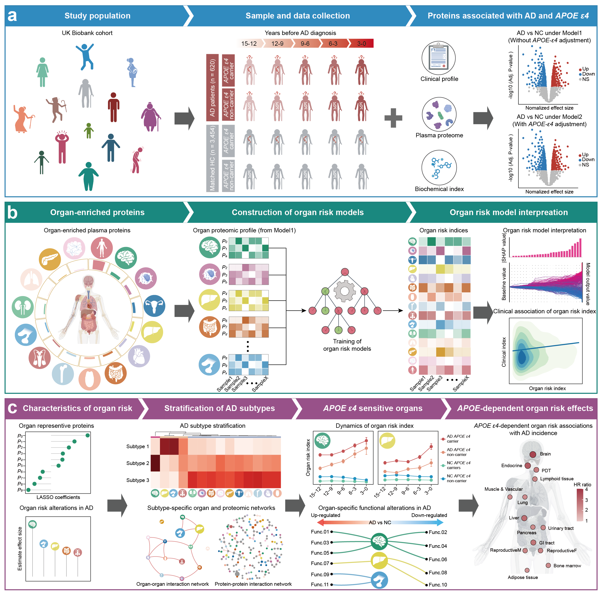

# Organ-trajectory-and-heterogeneity-in-AD

<p align="center">
  
</p>

<p align="center">
Overview of the study.
</p>


# Overview

This repository contains the analysis code and example files for a plasma proteomics study of Alzheimer’s disease (AD). The project uses plasma protein profiles to derive organ-resolved risk indices and characterize their trajectories and heterogeneity during the years preceding AD.


## Repository Structure

```text
.
|-- data/example/       Example input files organized by analysis module
|-- docs/               Data dictionary and R dependency list
|-- figures/            Figures displayed in this README
|-- scripts/            R and Python analysis scripts
|-- .gitignore
|-- LICENSE
|-- README.md
`-- requirements.txt
```

The directories under `scripts/` and `data/example/` use the same module names:

| Module | Analysis |
| --- | --- |
| `01-proteome` | PERMANOVA, residual adjustment, differential analysis, and Mfuzz clustering |
| `02-organ-risk` | Organ risk index, LASSO feature selection, and linear models |
| `03-subtyping` | NMF subtyping, differential proteins, enrichment, networks, and driver scores |
| `04-functional-analysis` | Organ-specific gene sets, ssGSEA, and pathway-level linear models |
| `05-survival-analysis` | Cox proportional-hazards models |

## Example Data

| Module | Files provided |
| --- | --- |
| `01-proteome` | `protein_expression.csv`, `protein_adjusted.csv`, `protein_time_series.csv`, `sample_metadata.csv` |
| `02-organ-risk` | `protein_adjusted.csv`, `protein_to_organ.tsv`, `organ_risk_index.csv`, `sample_metadata.csv` |
| `03-subtyping` | `organ_risk_index.csv`, `protein_adjusted.csv`, `cluster_membership.csv`, `protein_network.csv`, `protein_to_organ.tsv`, `sample_metadata.csv` |
| `04-functional-analysis` | `protein_adjusted.csv`, `protein_to_organ.tsv`, `organ_pathway_scores.csv`, `sample_metadata.csv` |
| `05-survival-analysis` | `organ_risk_index.csv`, `sample_metadata.csv` |

The example files are synthetic and intended to demonstrate input schemas. They are not study data and are too small for reliable scientific inference.

## Installation

Python 3.10+ dependencies are listed in `requirements.txt`:

```bash
python -m venv .venv
source .venv/bin/activate       # Windows: .venv\Scripts\activate
python -m pip install -r requirements.txt
```

R package requirements are listed in `docs/r-packages.txt`. 

## Usage

Run scripts from the matching example directory.

```bash
# Proteome differential analysis
cd data/example/01-proteome
Rscript ../../../scripts/01-proteome/02-differential-analysis.R

# Organ risk index
cd ../02-organ-risk
python ../../../scripts/02-organ-risk/organ-risk-index.py
```

## Input Requirement

- Sample IDs must match exactly across files used in the same analysis.
- Clinical groups are encoded as `NC` and `AD`.
- Organ mappings are tab-separated files with columns `Organ` and `Protein`.
- Human gene symbols are required for overlap with MSigDB in functional analysis.
- Survival metadata requires `Group` and `Year`; `E4_status` and `Range` are optional interaction variables.

See `docs/data-dictionary.md` for column definitions.

## License

The code is released under the MIT License.

## Contact

For questions, collaborations, or bug reports, please open an issue or contact:

[xhchena@ust.hk](mailto:xhchena@ust.hk);[xjy005351@siat.ac.cn](mailto:xjy005351@siat.ac.cn).
